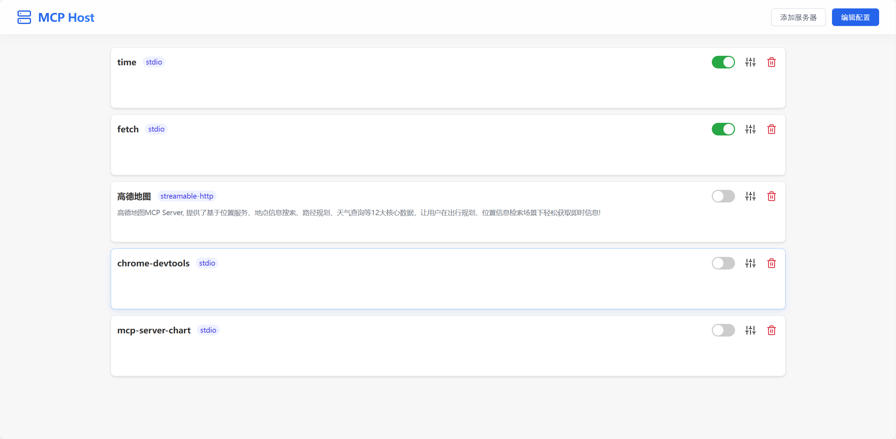

# 🚀 MCP Host 

## 🎯 项目功能

- 提供管理 MCP Server 配置的可视化面板：在页面中查看/新增/编辑/启用/禁用服务器与工具，并支持备注与工具开关管理
- 简化智能体开发：由MCP Host 负责选择服务器并执行真实工具调用，开发者无需操心如何调用MCP工具

<div align="center">
  
  <p>MCP管理页面：展示服务器列表、启用/禁用开关、删除按钮与进入设置页的入口。</p>
  
</div>

<div align="center">
  
  <p>工具页面：展示选中服务器的工具清单与参数说明，支持按工具启用/禁用以及填写并保存备注。</p>
  
</div>

<div align="center">
  
  <p>项目架构图</p>
  
</div>

## ✈️ 管理MCP 服务器与工具

- 启动管理服务与前端：`python host_server.py`
- 打开主页：`http://127.0.0.1:8000/`，即可查看所有已配置的 MCP 服务器。
- 配置文件固定路径：`config/mcp_server_config.json`

**自定义端口与地址**

- 默认地址与端口：`127.0.0.1:8000`
- 命令行参数：
  - 指定端口：`python host_server.py --port 9000`
  - 指定地址与端口：`python host_server.py --host 0.0.0.0 --port 9000`
- 环境变量（作为默认值）：
  - `MCP_HOST_ADDR` 指定绑定地址（默认 `127.0.0.1`）
  - `MCP_HOST_PORT` 或 `PORT` 指定端口（默认 `8000`）
- 优先级：命令行参数 > 环境变量 > 默认值


## ✨ 使用 MCP Host 快速开发智能体
您可通过MCPHost轻松调用MCP工具:
```python
from mcp_host import MCPHost  # 引入 MCP Host

host = MCPHost()  # 0.初始化 Host（聚合与路由工具）

tools = host.list_all_tools()  # 1.读取启用服务器的工具注册表
guide = host.tools_guide(tools)  # 2.生成参数指南供大模型参考
has_tool, spec = host.detect_tool(content)  # 3.从大模型输出解析 <tool> 指令 JSON
tool_result = host.call_tool(spec, formated=True)  # 4.执行工具调用并返回格式化结果
```

- `list_all_tools`：读取所有启用服务器的可用工具，形成注册表用于提示与后续调用。
- `tools_guide`：从 JSON Schema 提取参数说明，生成人类可读指南，引导模型填参。
- `detect_tool`：从模型输出中提取 `<tool>` 指令的 JSON，有则进入调用链，无则直接回复。
- `call_tool`：按工具名自动定位服务器并执行，返回格式化的 `{name, server, result}` JSON，供下一轮注入 `<tool_result>...</tool_result>`。

示例代码

```python
import os
import json
from dotenv import load_dotenv
from openai import OpenAI
from mcp_host import MCPHost # 引入 MCP Host

load_dotenv(override=False)

client = OpenAI(base_url=os.getenv("LLM_BASE_URL"), api_key=os.getenv("LLM_API_KEY"))
model = os.getenv("LLM_MODEL")

host = MCPHost()  # 0.初始化 Host（聚合与路由工具）
tools = host.list_all_tools()  # 1.读取启用服务器的工具注册表
guide = host.tools_guide(tools)  # 2.生成参数指南供大模型参考

user_msg = input("请输入消息: ").strip()
sys_prompt = (
    "你是人工智能助手。可使用 MCP 工具。若需要调用工具，"
    "请仅输出如下格式文本：<tool>{\n\t\"type\": \"function\",\n\t\"name\": \"<工具名>\",\n\t\"parameters\": {…}\n}</tool>。"
    "以下为各工具的使用说明：\n" + guide
)

first = client.chat.completions.create(
    model=model,
    messages=[
        {"role": "system", "content": sys_prompt},
        {"role": "user", "content": user_msg},
    ],
)
content = first.choices[0].message.content or ""

has_tool, spec = host.detect_tool(content)  # 3.从大模型输出解析 <tool> 指令 JSON
if has_tool:
    tool_result = host.call_tool(spec, formated=True)  # 4.执行工具调用并返回格式化结果
    second = client.chat.completions.create(
        model=model,
        messages=[
            {"role": "system", "content": sys_prompt},
            {"role": "user", "content": user_msg},
            {"role": "assistant", "content": content},
            {"role": "system", "content": "<tool_result>" + tool_result + "</tool_result> 请基于工具结果用中文回复用户。"},
        ],
    )
    print(second.choices[0].message.content or "")
else:
    print(content)
```

## 🤖 模型兼容性

- 支持任意兼容 OpenAI SDK 的大模型与服务商：将 `LLM_BASE_URL`、`LLM_API_KEY`、`LLM_MODEL` 配置为对应厂商的网关与模型即可使用。
- 示例：Ark 平台 `LLM_BASE_URL=https://ark.cn-beijing.volces.com/api/v3`；其他 OpenAI 兼容网关也可按需替换。


## 🛠️ 环境与依赖

- 安装依赖：`pip install -r requirements.txt`
- Python: `>=3.10`
  - 验证: `python --version`
- Node.js: `>=18`
  - 项目根含 `.nvmrc`（值为 `18`），使用 nvm/nvm-windows 可执行 `nvm use 18`
  - 需确保 `npm/npx` 在 `PATH` 中
  - 验证: `node -v`、`npm -v`、`npx --version`
- uv/uvx（可选，用于部分 stdio 服务器）
  - 验证: `uvx --version`
- Docker（如使用 `github` 服务器条目）
  - 当前配置通过 `docker run -i --rm -e GITHUB_PERSONAL_ACCESS_TOKEN mcp/github` 启动，该条目需要本机安装并可用的 Docker
  - 验证: `docker --version`

## 🧪 示例 Demo

- `demo_agent.py`：只支持单次调用工具。
- `demo_agent_multi.py`：支持多轮次工具调用，可连续对话（注意：用户每次输入新问题后，上下文窗口都会重置，即智能体不会记忆之前的对话）。

运行前准备：
- 启动管理服务：`python host_server.py`（或指定端口：`python host_server.py --port 9000`）
- 在 `config/mcp_server_config.json` 中确保至少有一个启用的服务器
- 设置模型环境变量：`LLM_BASE_URL`、`LLM_API_KEY`、`LLM_MODEL`

运行示例：
- 单次调用链：`python demo_agent.py`
- 多步交互：`python demo_agent_multi.py`

